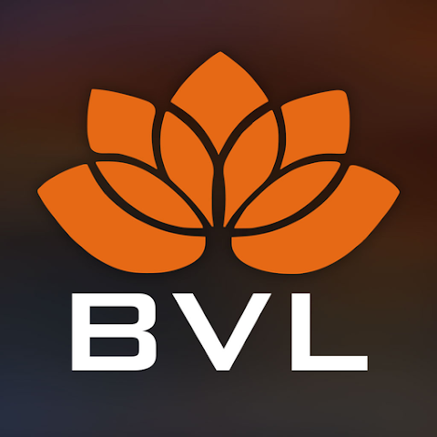

# MyBVL
<figure markdown>
  { width="300" }
</figure>

## About
His Divine Grace A.C. Bhaktivedanta Swami Prabhupada is widely accepted as the world’s foremost author and scholar of the Vedic Teachings. The heart of the Bhaktivedanta Vedic Library is a comprehensive offering of His books and teachings presented in audio form, available to be streamed or downloaded, free of charge.

## Download the App

- :material-google-play: [Android](https://play.google.com/store/apps/details?id=com.beyond.bvl)
- :material-apple-ios: [iOS](https://apps.apple.com/us/app/my-bvl/id1452929393?ls=1)