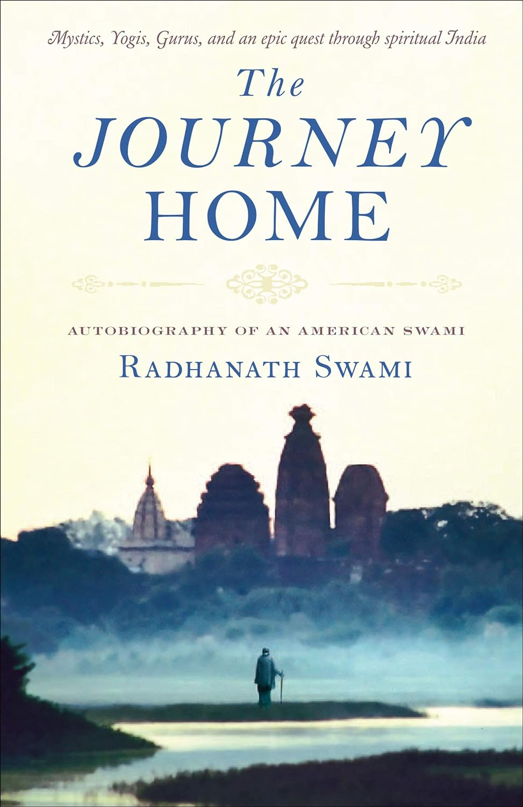

<figure markdown>
  { width="300" }
  <figcaption>Book Cover</figcaption>
</figure>

Within this extraordinary memoir, Radhanath Swami weaves a colorful tapestry of adventure, mysticism, and love. Readers follow Richard Slavin from the suburbs of Chicago to the caves of the Himalayas as he transforms from young seeker to renowned spiritual guide. The Journey Home is an intimate account of the steps to self-awareness and also a penetrating glimpse into the heart of mystic traditions and the challenges that all souls must face on the road to inner harmony and a union with the Divine. Through near-death encounters, apprenticeships with advanced yogis, and years of travel along the pilgrim’s path, Radhanath Swami eventually reaches the inner sanctum of India’s mystic culture and finds the love he has been seeking. It is a tale told with rare candor, immersing the reader in a journey that is at once engaging, humorous, and heartwarming.

## Purchase Here
- [Amazon](https://www.amazon.com/Journey-Home-Radhanath-Swami-ebook/dp/B01INNBZHW/ref=sr_1_1?crid=19RJZ6MH6WLWS&keywords=the+journey+home&qid=1703365258&sprefix=the+journey+hom%2Caps%2C153&sr=8-1)
## Listen Here
- [Youtube](https://youtube.com/playlist?list=PLSbL_RXLcZk9WkLKTmdAJcL3V29HChZy6&si=xVJ5VolzYD916cmM)