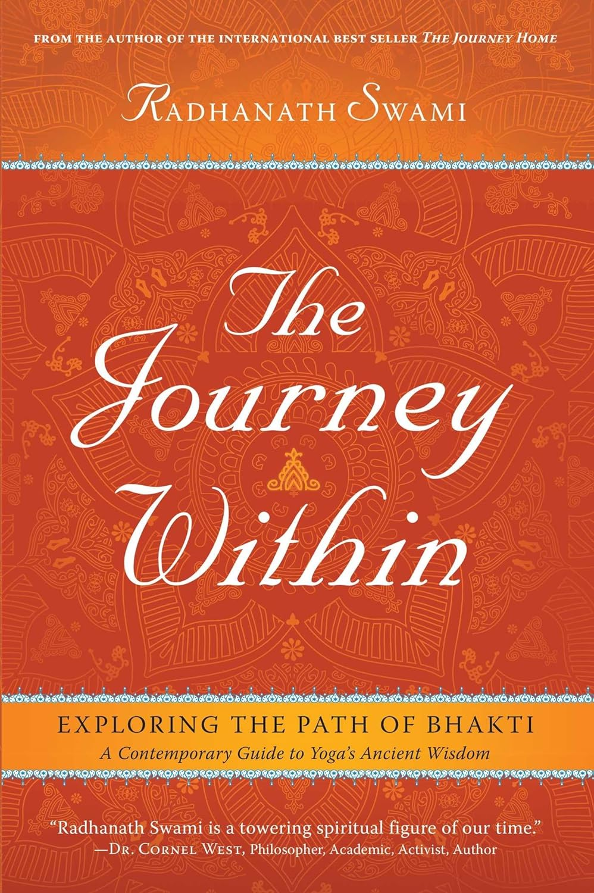

<figure markdown>
  { width="300" }
  <figcaption>Book Cover</figcaption>
</figure>

The mysteries of the soul have evaded mystics, sages, and gurus for centuries. Humanity has long yearned to discover the answer to our existence, and many spiritual traditions have evolved to provide those answers through sacred texts that facilitate journeys of transformation and discovery. Yet, never before have all of the spiritual traditions been distilled so simply into one easy-to-follow path—a path of love and devotion.

In this long-awaited follow-up to The Journey Home, New York Times bestseller The Journey Within guides readers through the essential teachings of bhakti yoga. World-renowned spiritual leader Radhanath Swami draws from his personal experiences to demystify the ancient devotional path of bhakti, capturing its essence and explaining its simple principles for balancing our lives.

His down-to-earth writing simplifies spiritual concepts and answers timeless questions in a heartfelt narrative that brings this sacred philosophy beautifully to life. What is love? What is the soul? Who is God? How can we live in the physical world without losing touch with the spiritual?

In concise and approachable language, Radhanath Swami sheds light on how to answer these vital questions and offers solutions to life’s challenges with the simplest of resources. Reach beyond the material world and journey within to discover the beauty of the true self.

## Purchase Here
- [Amazon](https://www.amazon.com/Journey-Within-Exploring-Path-Bhakti/dp/1608871576/ref=sr_1_1?crid=3KJXHDADIH2QH&keywords=the+journey+within&qid=1703372477&sprefix=the+journey+within%2Caps%2C169&sr=8-1)